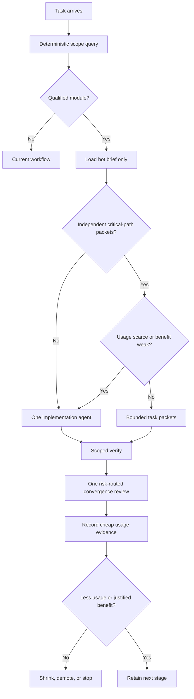

# Capsule MVP — Token-Efficient Verified Modules

This plan implements the reconciliation in `docs/capsules/CONSENSUS-2026-07-24.md`. It supersedes the earlier standalone “module-workspaces” plan.

## Product verdict

**Continue, reshaped. Confidence: 0.78 for observed/scoped modules; 0.45 for multi-agent savings.**

The immediate product is not “one agent per capsule.” It is:

> Generate a tiny, accurate module brief and dependency graph so one agent reads less and verifies less; use multiple agents only when independent work packets save enough wall-clock time to justify their duplicated subscription usage.

Subscription exhaustion is a reliability failure. The MVP succeeds only if accepted tasks use less or comparable provider usage than the current workflow. Faster wall-clock with materially higher usage is an optional throughput mode, not the default.

Strongest reason to continue: the current workflow already optimizes routing, review count, and scoped verification; module facts can make those decisions more precise and reduce exploratory reading.

Strongest counterargument: every generated contract is fixed context tax, and every spawned agent repeats context. Capsules could turn a lean workflow into expensive architecture ceremony. The staged plan kills or narrows the idea if that happens.

## Pitch gaps resolved

| Gap | Resolution |
|---|---|
| Usage/token economics was secondary | Net subscription usage per accepted task is now a primary metric |
| Module graph implied automatic fleet fan-out | Single-agent default; fan-out has an admission test |
| Large `CONTRACT.md` could become fixed context tax | Hot view targets ~300 words; detail is queried |
| Standalone CLI duplicated kit machinery | Extend `llm-workflow.config.json` and `scope.mjs` |
| Five maturity levels added ceremony | Three states: folder, observed, enforced |
| “Channels” sounded like security capabilities | Observed side effects for review routing only |
| Internal semver and test classification were speculative | Compatibility flag + consumer closure; no v1 versions |
| Pilot measured speed but not subscription continuity | Record provider usage or cheap, consistent proxies |

Open: subscription products may expose opaque weighted usage rather than raw token counts. The workflow records provider-reported usage when cheaply available and otherwise uses the same proxies before and after. It does not claim false precision.

## PRD

### Users and job

Primary user: a subscription-funded developer using coding agents in a modular repository.

Job:

> Complete a correct change without loading irrelevant repository context, running irrelevant verification, spawning unnecessary agents, or exhausting the subscription needed for the next task.

### Goals

- Generate a compact, position-loaded brief for one qualified module.
- Derive actual static dependencies and direct consumers with provenance.
- Feed conservative module impact into the existing scoped workflow.
- Enforce one stable boundary only after observed mode pays.
- Make agent fan-out explicit and usage-budgeted.
- Measure context and agent overhead against the current workflow.

### Non-goals

- Automatic fleets for every task.
- A separate module CLI platform, daemon, broker, database, or dashboard.
- Cross-stack adapter framework before repeated implementations exist.
- Runtime security sandboxing or fault isolation.
- Internal semantic versions.
- Provider fakes, pending expectations, attestations, mutation gates, or regeneration in v1.
- Perfect token accounting when the provider does not expose it.

### Requirements

#### R1 — Optional module configuration

Extend the existing repository config with optional modules:

```json
{
  "modules": [
    {
      "name": "exposure",
      "root": "src/features/exposure",
      "mode": "observed",
      "publicEntries": ["src/features/exposure/public.ts"],
      "allowedDeps": ["pricing", "platform/api-client"],
      "verify": ["pnpm --filter exposure test"]
    }
  ]
}
```

Existing repositories without `modules` behave exactly as before.

#### R2 — Deterministic observed facts

For the first selected stack, consume one existing analyzer and derive:

- public entry paths;
- actual direct module/platform edges;
- direct consumers;
- unresolved or dynamic edges;
- analyzer identity/version/input digest;
- observed side-effect categories supported by the adapter.

Analyzer failure, stale output, ambiguous ownership, or empty-success anomalies fail closed or widen scope. “Not analyzed” never means “not affected.”

#### R3 — Hot contract view

Generate `CONTRACT.md` containing only:

- purpose and short intent invariants;
- public entry paths;
- direct allowed and actual edges;
- verify command and honest isolation label;
- observed side effects and blind spots;
- command/path for detailed queries.

Guardrails:

- capsule `AGENTS.md` loader target: under 100 words;
- hot `CONTRACT.md` target: about 300 words, review required above 500;
- no full export list, consumer closure, graph, history, logs, or attestations;
- no volatile timestamps in tracked output.

#### R4 — Token-efficient impact

Teach `scope.mjs` to:

- map changed files to modules;
- keep a known-private change local when evidence supports it;
- include direct/transitive consumers for public, policy, stale, unknown, or unresolved changes;
- print one short reason path per widened module;
- run the union of required commands once;
- preserve the existing gate-equivalent optimization.

The full graph remains machine data, never prompt preamble.

#### R5 — Observed/enforced behavior

- `observed`: report boundary findings without failing.
- `enforced`: reject deep/internal imports, undeclared edges, and selected direct I/O primitives.
- exceptions have owner, reason, and expiry.
- side-effect findings route review; they are not security claims.

#### R6 — Fan-out admission

One implementation agent is the default. Multiple workers require:

1. at least two independent, substantive packets;
2. stable or cheaply declared public cut edges;
3. low write overlap;
4. meaningful expected wall-clock benefit;
5. no user signal that usage is scarce or economy operation is required.

Implementers, reviewers, retries, and reconciliation share one task budget. Do not create a reviewer per packet.

#### R7 — Usage measurement

Prefer provider-reported task usage when it is visible without extra agent work. Otherwise record:

- implementation and review agents started;
- agent turns;
- prompt/context words or bytes supplied by the orchestrator;
- unusually large tool-output reads;
- foreign files read;
- retries and review passes;
- wall-clock and accepted correctness;
- whether usage exhaustion interrupted work.

The recorder must be deterministic and nearly free. Do not spend an LLM turn summarizing telemetry.

### User stories

1. As a local-task agent, I load one short module brief and avoid searching unrelated features.
2. As an orchestrator, I query affected scope and receive concise reasons rather than loading a full graph.
3. As a subscription user, I get one worker unless parallelism clearly pays.
4. As a reviewer, I review the converged semantic change, not duplicate per-capsule reports.
5. As a maintainer, I can demote or remove an observed/enforced boundary when its context cost exceeds its value.

### Acceptance criteria

- A cold agent states the module's purpose, public paths, direct edges, verify command, and blind spots from the hot brief.
- The brief plus required workflow context is smaller than the foreign reading it replaces on pilot tasks.
- Existing non-module configuration and scope behavior remain green.
- Analyzer failure cannot produce a trusted empty graph.
- Public/unknown changes widen scope with a reason; supported private changes stay local.
- Seeded internal and undeclared edges fail in enforced mode.
- A local task spawns no subagent by default.
- A parallel task records why fan-out passed admission and uses one convergence review.
- Provider usage or the agreed proxy is compared with baseline for every pilot decision.

### Success metrics

Primary:

- provider usage or consistent usage proxy per accepted task;
- subscription-exhaustion interruptions;
- held-out correctness.

Secondary:

- foreign reads;
- irrelevant verification commands avoided;
- wall-clock;
- boundary escapes caught before integration;
- module policy/report maintenance time;
- agent and review count.

Decision rule: a capsule feature that increases normal-task usage without a compensating correctness or continuity benefit is removed or moved out of hot context.

## Workflow



## Technical stack

- Runtime: existing Node.js ESM scripts.
- Configuration: extend `llm-workflow.config.json`.
- Scope/verification: extend `scripts/scope.mjs` and `scripts/lib/core.mjs`.
- Graph source: one concrete existing analyzer selected for the pilot repository.
- Generated view: deterministic Markdown.
- Tests: existing `node:test` suite with focused fixtures.
- Persistence: source-controlled config/report plus small per-task measurement files only if existing workflow evidence cannot hold the fields.
- Frontend: none.
- Backend/service: none.
- Database/auth/hosting: none.
- Third-party runtime service: none.
- Observability: terminal output and optional provider usage reading; no dashboard.
- Local development: existing package scripts and repository gate.

This is a kit extension, not a new application.

## Technical specification

### Hot, warm, and cold context

**Hot, automatically loaded**

- root router;
- normal workflow and project truth already selected by the router;
- capsule loader;
- current module's compact contract;
- task packet.

**Warm, loaded on a demonstrated edge**

- direct provider/consumer public declaration;
- changed intent/contract evidence;
- one impact explanation.

**Cold, queried only for diagnosis**

- full graph;
- generated API report;
- consumer closure;
- module history/docs;
- foreign internals;
- attestations and experiment reports.

### Work packet

A generated packet contains:

- goal and acceptance evidence;
- writable roots;
- allowed public dependency paths;
- changed cut edges;
- focused verify command;
- handoff output path.

It points to contracts and plans by path/digest. It does not paste them.

### Side-effect funnel

For the first stack, forbid selected direct ambient APIs inside enforced modules and require platform wrappers. Wrapper categories may include network, environment, storage, secrets, shared state read/write, time, and process execution.

Unknown/dynamic access becomes unverifiable and widens review. The mechanism supports accidental-use detection and risk routing, not adversarial containment.

### Error behavior

- Invalid config: fail with field and module.
- Missing/stale analyzer output: fail observed generation and widen normal task scope.
- Unmapped changed file: preserve existing `verify-gap` and add conservative scope.
- Enforced illegal edge: fail with source, target, rule, and legal public path when known.
- Oversized hot brief: fail its budget test or require explicit evidence-backed exception.
- Usage telemetry unavailable: record unavailable; use configured proxies.

### Security and privacy

- Never store prompt contents or secrets for usage accounting.
- Count sizes/turns, not sensitive text.
- Do not label lint-derived effects as permissions or security isolation.
- High-risk work retains the original workflow's human-review rules.

### Migration

1. Missing `modules` means old behavior.
2. Add one observed module without moving code.
3. Validate report usefulness and usage.
4. Integrate impact conservatively.
5. Promote only one earned boundary.
6. Demotion removes enforcement without deleting ordinary feature structure.

### Test strategy

Minimum focused cases:

- old config remains compatible;
- deterministic compact contract and budget cap;
- analyzer failure/empty output fails closed;
- private change stays local;
- public/unknown change includes explained closure;
- observed violation reports, enforced violation fails;
- duplicate verify commands execute once;
- usage record contains no prompt contents.

Avoid a large cross-stack fixture framework before the first pilot pays.

## Gotchas and rejected paths

- **Token paradox:** more context can reduce searches but still cost more overall. Measure net usage.
- **Parallelism paradox:** faster wall-clock may consume multiples of the subscription. Default to one worker.
- **Review multiplication:** worker reviewers plus final review duplicate cost. Review at the widest useful seam.
- **Huge generated contracts:** full APIs and graphs belong in cold artifacts.
- **Telemetry tax:** detailed accounting can cost more than it saves. Prefer provider totals or cheap counters.
- **Opaque subscription weighting:** raw token proxies may not match provider limits. Compare consistently and record uncertainty.
- **Bad boundaries:** agents obediently pay context tax forever. Observed mode and demotion are first-class.
- **Static blind spots:** dynamic imports and shared state can create missing edges. Fail conservatively.
- **Platform funnel growth:** wrappers can become a god layer. Keep them capability-specific and mechanically thin.
- **Security theater:** lint supports routing, not containment.
- **Premature adapter framework:** implement one stack, extract after repeated evidence.
- **Novelty marketing:** describe a tested workflow composition, not a new universal architecture.
- **Legal/privacy:** do not persist prompts or proprietary code in telemetry.
- **Operational continuity:** usage exhaustion blocks all later work; optional experiments stop before required delivery.
- **Go-to-market:** none for the MVP. It is an internal workflow experiment until measured evidence supports publishing.

## Staged plan

### Stage 0 — Pin baseline and budget

- Select one qualified module and several normal task types.
- Record current provider usage when visible or choose fixed proxies.
- Capture current foreign reads, agents/reviews, verification commands, and correctness.
- Set the initial 100/300/500-word hot-context guardrails.

Exit: baseline method is cheap enough to use and no capsule code exists yet.

### Stage 1 — Observed hot brief

- Extend config compatibly.
- Consume one concrete analyzer output.
- Generate one deterministic budgeted `CONTRACT.md`.
- Fail closed on missing, stale, or empty analysis.

Exit: a cold agent needs less total context to answer the module questions, with no correctness loss.

### Stage 2 — Scope integration

- Map changed files to modules.
- Keep supported private changes local.
- Widen public/unknown changes through explained consumer closure.
- Preserve command de-duplication and gate-equivalence.

Exit: existing tests plus focused impact cases pass; pilot tasks run fewer irrelevant checks without misses.

### Stage 3 — One enforced boundary

- Enforce public paths and allowed edges.
- Add the smallest valuable I/O funnel rule.
- Add owned, expiring exceptions.

Exit: seeded and natural escapes are caught early, while maintenance and usage remain lower than the cost removed.

### Stage 4 — One fan-out experiment

- Use a fixed cross-module task and held-out acceptance cases.
- Run a one-worker baseline and one admitted task-packet fleet.
- Count setup, repeated context, reviews, retries, convergence, usage, correctness, and wall-clock.

Exit: decide whether parallelism is default-never, explicit opt-in, or justified for a narrow task class. It does not become automatic from one win.

### Stage 5 — Consolidate or kill

- Remove unused fields and cold artifacts from hot context.
- Demote boundaries that did not pay.
- Update design/pilot/skill docs to exactly the surviving behavior.

Exit: one source of truth, measured usage decision, full gate green.

## Initial implementation loop prompt

```text
Implement the first unfinished stage in capsule-mvp.md.

Before editing:
1. Read docs/capsules/CONSENSUS-2026-07-24.md, capsule-mvp.md, the root
   AGENTS.md, skills/workflow.md, and only the branch skills it routes.
2. Treat subscription continuity as a hard constraint. Single-agent is the
   default. Do not spawn implementation or review agents merely because
   capsules exist.
3. Pin the stage acceptance evidence and usage measurement/proxy.

For each stage:
1. Implement the smallest end-to-end slice and add focused tests.
2. Run focused verification, then scope.mjs against the fixed point.
3. Record provider usage when cheaply visible; otherwise record the fixed
   proxies without copying prompt contents.
4. Self-review against correctness, net usage, and the stage exit criterion.
5. If the calibrated profile authorizes independent review and the task budget
   can afford it, launch only the allowed review agent(s) in parallel on their
   own branches. Continue non-overlapping main-thread work while they inspect.
6. Merge or cherry-pick only verified improvements, reconcile once, and rerun
   affected verification. Do not create one reviewer per module or slice.
7. If subagent/branch tools are unavailable or usage is scarce, perform the
   manual equivalent: self-review, record findings, and continue only after the
   exit criterion passes.
8. Stop at the stage boundary for the continue/demote/kill decision; do not
   implement speculative later stages.

Parallel implementation is authorized only in Stage 4 and only when the fan-out
admission test passes. Each worker gets a compact path-based packet, a bounded
write scope, and focused verification. Review the converged result once.

After every stage:
- update durable progress and exact verifier/usage evidence;
- update AGENTS.md only for an approved reusable behavior;
- when AGENTS.md is touched, rewrite it for concise LLM consumption: stable
  headings, short bullets, no duplicated rules or stale process notes, and
  highest-signal guidance first;
- report whether the capsule reduced net usage or merely shifted it.
```

## AGENTS.md policy

Root instructions own:

- single-agent default and fan-out admission;
- shared implementation/review usage budget;
- progressive context disclosure;
- observed versus enforced behavior;
- graph/scope commands;
- “not analyzed” widening;
- risk-routed review caps.

Module instructions are loaders under 100 words. They point to the compact contract and verify command without duplicating global rules.

Durable-memory rule:

- record a pattern only after user approval, repeated success, or a failure it would prevent;
- when adding it, remove duplication and stale instructions;
- keep context-budget tests for frequently loaded files;
- generated facts never become hand-maintained prose;
- a rule that adds more context than the observed failure justifies is rejected.

The design is successful when capsules lower the cost of correct work. Fleet size is not a success metric.
